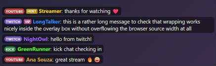
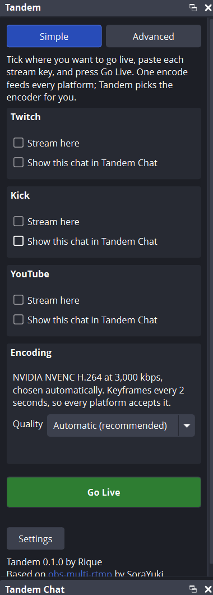

# Tandem

Stream to Twitch, Kick and YouTube at the same time from one OBS encode, and read every chat in one dock.

Tandem is an OBS Studio plugin. It adds extra streaming targets next to OBS's own stream, lets them reuse OBS's encoder so going live on three platforms costs about the same CPU/GPU as going live on one, and merges chat from the platforms you pick into a single dock (plus an optional on-stream overlay).

Everything is opt-in. Stream to one platform, two, or all three; read chat from any subset; turn the overlay on only if you want it.

> Tandem is a fork of [obs-multi-rtmp](https://github.com/sorayuki/obs-multi-rtmp) by SoraYuki. See [CREDITS.md](CREDITS.md).



## Features

**Simple or Advanced**
- Simple mode: tick platforms, paste keys, press Go Live. The encoder and bitrate are chosen for you.
- Advanced mode: every setting of every target, for custom setups.

**Multistreaming**
- Extra outputs for Twitch, Kick, YouTube or any RTMP/RTMPS, SRT/RIST or WHIP server.
- Platform presets fill in the ingest URL; paste your stream key, or import OBS's own stream settings in one click.
- Shared encoder by default: one encode feeds every output. A separate encoder per target is still available (and clearly marked as costing extra CPU/GPU).
- Per-target "go live with OBS" checkbox: ticked targets start and stop with the OBS stream and with **Start enabled**.
- Live status per target: connecting, streaming, reconnecting, stopped with the reason, bitrate, FPS and dropped frames.
- Reconnects use the same retry settings as OBS's own stream. A server that keeps accepting and then dropping the connection (the "endless reconnect" case) is detected and stopped with an explanation.
- One failing target never stops the others.
- Upload estimate for everything that is live or enabled, with an optional warning when it gets close to your upload capacity.
- Twitch bandwidth-test mode for private test runs.
- Stream keys are kept in Windows Credential Manager, not in plain-text config files.

**Unified chat**
- One dock with messages from Twitch, Kick and YouTube, labeled by platform, with author colors, roles and optional timestamps.
- Emotes as images: Twitch and Kick emotes, plus **7TV, BetterTTV and FrankerFaceZ** emotes (the ones viewers see with those browser extensions).
- Show/hide each platform, see each platform's connection status at a glance.
- Read-only. Twitch needs only a channel name, Kick only a channel slug, YouTube your own free API key.
- Updates are batched, the list is capped (500 messages by default), and all networking runs off OBS's video, audio and UI threads.

**Overlay (optional)**
- A local page for an OBS Browser Source that shows the merged chat on stream.
- Bound to `127.0.0.1` only. Styling through URL options or the Browser Source's Custom CSS.

**No accounts, no cloud, no telemetry.** Tandem talks only to the streaming and chat endpoints you configure. See [PRIVACY.md](PRIVACY.md).

## Requirements

- OBS Studio 32.2 or newer (built against 32.2.1, tested on 32.2.2).
- Windows 10/11 x64. macOS and Linux builds are produced by CI; see [the wiki](docs/wiki/Installation.md) for their current status.
- Enough upload bandwidth: roughly your bitrate × the number of outputs.

## Install

1. Close OBS.
2. Download the latest release and check its SHA-256 against the value on the release page.
3. Windows: run `tandem-*-windows-x64-Installer.exe`, or extract the `.zip` into your OBS folder (usually `C:\Program Files\obs-studio`).
4. Start OBS. The **Tandem** and **Tandem Chat** docks open the first time; later you can find them under **Docks**.

If you used obs-multi-rtmp before, Tandem imports its targets from the same OBS profile on first start (the old file is left untouched). Remove obs-multi-rtmp afterwards so you don't run both.

## Quick start



**Simple mode** (the default):

1. In the **Tandem** dock, tick **Stream here** on each platform you want.
2. Paste each stream key; each card links to the page where the platform shows it ([Twitch](https://dashboard.twitch.tv/settings/stream), [Kick](https://dashboard.kick.com/channel/stream), [YouTube Studio](https://studio.youtube.com/) → Go live). Optionally tick **Show this chat** and enter your channel name (YouTube also needs a free [API key](docs/wiki/Platform-Setup.md#youtube); the settings link to where you get it).
3. Press **Go Live**.

Tandem picks the best H.264 encoder on your computer (NVIDIA, AMD, Intel or Apple hardware, otherwise x264) and a bitrate that fits your resolution, and every platform shares that one encode. Ticked platforms also go live when you click OBS's own **Start Streaming**.

**Advanced mode** (button at the top of the dock) shows every target with all of its settings: custom servers, SRT/WHIP, reusing OBS's own encoder, separate encoders, scenes and resolutions per target, audio tracks and more. Both modes edit the same targets, so you can switch at any time.

Chat settings are also in **Tandem Chat** → **Settings**.

<br clear="right">


Full guides: [docs/wiki](docs/wiki/Home.md).

## Bandwidth

Upload needed ≈ bitrate × number of outputs. Three outputs at 6 Mbps need about 18 Mbps of steady upload, plus headroom. Sharing the encoder saves CPU/GPU, not bandwidth. See [Bandwidth and performance](docs/wiki/Bandwidth-and-Performance.md).

Measured on the development machine (OBS 32.2.2, x264 veryfast 720p30 at 2.5 Mbps, 2-minute runs): adding three shared-encoder targets plus Twitch and Kick chat raised OBS's CPU from 1.70% to 1.85%, with zero skipped or dropped frames in both runs.

## Platform rules

You are responsible for following each platform's terms. Twitch requires simulcasts to be at least as good on Twitch as elsewhere; Kick partners must enable Kick's multistreaming setting; showing a merged chat on stream may be restricted by some platforms. See [Platform rules](docs/wiki/Platform-Rules.md).

## Building from source

```
cmake --preset windows-x64
cmake --build --preset windows-x64 --config RelWithDebInfo
```

Unit tests (no OBS needed): `cmake -S tests -B build_tests` then `cmake --build build_tests` and `ctest --test-dir build_tests`. Details: [Building from source](docs/wiki/Building-from-Source.md).

## Credits and license

Tandem is based on obs-multi-rtmp by SoraYuki and built with the OBS Project's plugin template. It is licensed under the GNU General Public License v2.0 or later; see [LICENSE](LICENSE) and [CREDITS.md](CREDITS.md).

Not affiliated with or endorsed by Twitch, Kick, YouTube/Google or the OBS Project. All names belong to their owners; Tandem uses plain text labels instead of platform logos.
